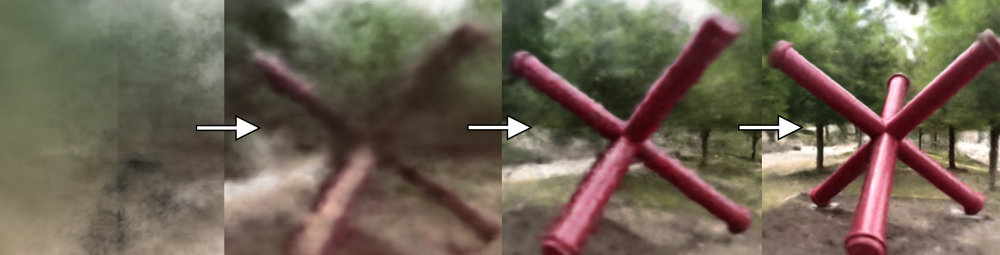
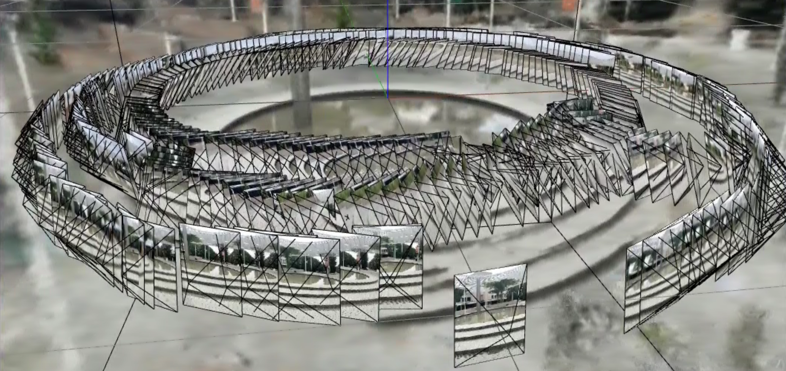
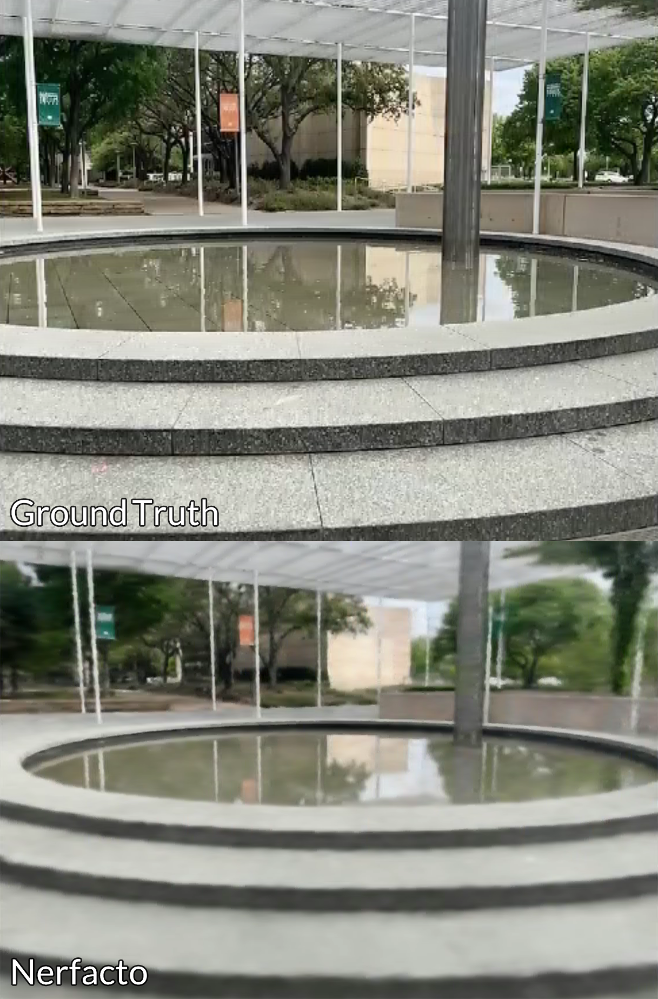

# NeRF or Nothing
> Measuring Immersion in Neural Radiance Fields.

This is the GitHub repo for the NeRF or Nothing ACM Research project for Spring 2023.

## Introduction

We evaluate different Neural Radiance Field methods' performance with various input data and their applicability in immersive environments for future technology. Additionally, we examine the method of capturing and processing the data, as the time and ease of access will also affect applications looking to use NeRFs.

## Methods 

Using a mix of qualitative and quantitative observations, we attempted to ascertain the applicability of different NeRF methods in immersive environments for future technologies. Diverse capture methods and environments were used as data to train 4 different NeRF methods. Eighteen datasets were collected by us, six different locations (dark scene, lit scene, normal scene, reflective scene, outside scene) with three different capture methods (Insta360 One RS's 4K & 360 modules and an Apple iPhone 12 Pro). Another eight datasets were taken from the original NeRF research paper and code for a total of twenty-six datasets. The goal was to achieve 5 different trials for each method on each dataset, but due to limitations of the technology this proved to not be realistic.

## Implementation

The 8 datasets used from the Original NeRF paper were pre-matched to camera angles but the other 18 had to be processed. The 4k and 360 camera data were processed using COLMAP while the iPhone 12 Pro data was processed at time of capture using Polycam. After processing, the methods were trained using nerfstudio's API which simplifies the end-to-end process of training to viewing a NeRF. Most training was done with a NVIDIA GeForce RTX 3090 and 128GB of DDR4 RAM. We then compared the results of each capture method and training method using the following to measure immersion capabilities: Time Taken to Train, Memory, Storage, and GPU Usage, Percentage Loss, Observations of the qualities of the rendered NeRF, and Accuracy compared with the real dataset. 

The referenced datasets are under Instant-NGP/data.

## Conclusions

 The limitations of current Neural Radiance Fields variations are self-evident and plenty. Older methods such as NeRF and Mip-NeRF in particular take long periods of time to train and produce less than satisfactory results using real data, up to two days. Newer methods, Nerfacto and Instant-NGP produce better results much faster, as quick as 10 minutes to a minute and a half, but still lack the needed quality for real world applications. Detailed surfaces such as trees suffer from distortion when they are in the background of a scene. Without a drone or some other equipment for bigger scenes, bird's eye views and other angles that differ drastically from the captured data suffer greatly, breaking the immersion for applications looking to utilize it. NeRFs also have a high barrier of entry, requiring a very powerful computer and much prior knowledge. Despite these flaws, data capture and processing was extremely easy, especially with Polycam and nerfstudio. There has also been a a huge step in the right direction between the Original NeRF published in August of 2020 and Instant-NGP published in July of 2022. While the results may not be exactly suited for an immersive application yet, they are exponentially heading that direction.
 
 ## References
 
[Barron et al., 2021] Barron, J. T., Mildenhall, B., Tancik, M., Hedman, P., Martin-Brualla, R., and Srinivasan, P. P.
(2021). Mip-nerf: A multiscale representation for anti-aliasing neural radiance fields. ICCV.

[Mildenhall et al., 2020] Mildenhall, B., Srinivasan, P. P., Tancik, M., Barron, J. T., Ramamoorthi, R., and Ng, R.
(2020). Nerf: Representing scenes as neural radiance fields for view synthesis.

[Müller et al., 2022] Müller, T., Evans, A., Schied, C., and Keller, A. (2022). Instant neural graphics primitives with a
multiresolution hash encoding. ACM Trans. Graph., 41(4):102:1–102:15.

[Tancik et al., 2023] Tancik, M., Weber, E., Ng, E., Li, R., Yi, B., Kerr, J., Wang, T., Kristoffersen, A., Austin, J., Salahi,
K., Ahuja, A., McAllister, D., and Kanazawa, A. (2023). Nerfstudio: A modular framework for neural radiance field
development. arXiv preprint arXiv:2302.04264.

